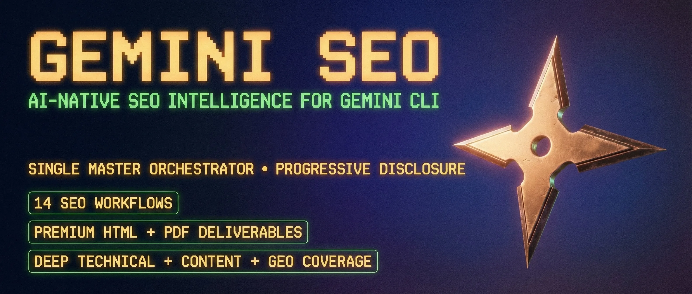

<p align="center">
  
</p>

# Gemini SEO

[](https://github.com/avalonreset/gemini-seo/actions/workflows/ci.yml)
[](https://github.com/avalonreset/gemini-seo/releases)
[](LICENSE)

Terminal-native SEO workflows for audits, technical diagnostics, content quality, schema, AI search readiness, local search, backlinks, international SEO, e-commerce SEO, and client-ready reporting.

Gemini SEO v1.9.9 includes 25 sub-skills (21 core + 1 orchestrator + 1 framework integration + 2 extension mirrors), 18 sub-agents (15 core + 1 framework integration + 2 extension mirrors), and 30 Python execution scripts.

Independent community project. Not affiliated with or endorsed by Google. Adapted from [AgriciDaniel/claude-seo](https://github.com/AgriciDaniel/claude-seo), with upstream attribution retained in [CONTRIBUTORS.md](CONTRIBUTORS.md).

## Commands

| Command | Description |
|---------|-------------|
| `/seo audit <url>` | Full website audit with parallel specialist analysis |
| `/seo page <url>` | Deep single-page SEO analysis |
| `/seo technical <url>` | Crawlability, indexability, security, and Core Web Vitals |
| `/seo content <url>` | E-E-A-T, readability, depth, and AI citation readiness |
| `/seo content-brief <topic>` | SEO content brief with target keywords and outline |
| `/seo schema <url>` | Schema.org detection, validation, and JSON-LD generation |
| `/seo sitemap <url>` | XML sitemap audit or generation |
| `/seo images <url>` | Image SEO, lazy loading, formats, alt text, and SERP readiness |
| `/seo geo <url>` | AI search readiness for AI Overviews, ChatGPT, Perplexity, and similar surfaces |
| `/seo plan <type>` | Strategic roadmap by business model |
| `/seo programmatic [url\|plan]` | Scaled-page strategy and thin-content controls |
| `/seo competitor-pages [url\|generate]` | Comparison, alternatives, and roundup page strategy |
| `/seo local <url>` | Local SEO, NAP, citations, reviews, GBP, and local schema |
| `/seo maps [command]` | Maps intelligence, geo-grid checks, GBP audit, and competitor radius mapping |
| `/seo hreflang <url>` | International SEO, hreflang graph checks, and cultural profiles |
| `/seo google [command] [url]` | Search Console, PageSpeed, CrUX, GA4, Indexing API, and reports |
| `/seo backlinks <url>` | Backlink profile analysis with free and optional paid sources |
| `/seo cluster <seed-keyword>` | SERP-overlap semantic clustering and content architecture |
| `/seo sxo <url>` | Search Experience Optimization, intent fit, personas, and page type |
| `/seo drift baseline <url>` | Capture a change-monitoring baseline |
| `/seo drift compare <url>` | Compare current SEO state against a saved baseline |
| `/seo ecommerce <url>` | Product schema, category pages, marketplace intelligence, and feeds |
| `/seo flow [stage] [url\|topic]` | FLOW framework prompts for Find, Leverage, Optimize, Win, and Local |
| `/seo dataforseo [command]` | Optional DataForSEO live data extension |
| `/seo firecrawl [command] <url>` | Optional Firecrawl full-site crawl extension |
| `/seo image-gen [use-case] <description>` | Optional SEO image planning and generation extension |

## Quick Start

Clone and run the installer:

```bash
git clone --depth 1 https://github.com/avalonreset/gemini-seo.git
bash gemini-seo/install.sh
```

Windows:

```powershell
git clone --depth 1 https://github.com/avalonreset/gemini-seo.git
powershell -ExecutionPolicy Bypass -File gemini-seo\install.ps1
```

The installer copies the skill tree, sub-skills, helper scripts, schema templates, optional extensions, and companion agent notes into user-level skill directories. It pins to the current release tag by default; override with `GEMINI_SEO_TAG=main` when you intentionally want the branch tip.

For a packaged Gemini CLI install, download `gemini-seo.skill` from the release assets and install it with:

```bash
gemini skills install path/to/gemini-seo.skill --scope user
```

## Architecture

```text
gemini-seo/
├── SKILL.md                    # Root compatibility wrapper
├── skills/
│   ├── seo/                    # Main orchestrator and shared references
│   └── seo-*/                  # Specialized sub-skills
├── agents/                     # Companion specialist instructions
├── scripts/                    # Python execution helpers
├── schema/                     # JSON-LD templates
├── extensions/                 # Optional DataForSEO, Firecrawl, and image workflows
├── tests/                      # Manifest, sync, and parser tests
└── docs/                       # Installation, commands, architecture, troubleshooting
```

The orchestrator uses progressive disclosure: read `skills/seo/SKILL.md` first, then load only the sub-skill and reference files needed for the task.

## Features

- Technical SEO: crawlability, indexability, security headers, redirects, canonicals, Core Web Vitals, and mobile checks.
- Content quality: E-E-A-T, topical depth, author signals, readability, thin content, and AI citation readiness.
- Structured data: JSON-LD detection, validation, schema generation, rich-result deprecation awareness, and video/live schema.
- GEO and AI search: crawler access, `llms.txt`, passage citability, brand mentions, and answer-engine readiness.
- Local and maps: GBP signals, NAP consistency, reviews, citations, geo-grid intelligence, and local schema.
- Backlinks: Moz, Bing Webmaster Tools, Common Crawl graph checks, backlink verification, and optional DataForSEO data.
- Strategy: roadmaps, content calendars, semantic clusters, competitor comparison pages, programmatic SEO, SXO, and drift monitoring.
- Reporting: Markdown, HTML, PDF, charts, Google SEO reports, and reusable schema/report templates.

## Requirements

- Python 3.10+
- Git
- Optional: Playwright Chromium for screenshot and visual analysis
- Optional API credentials for Google APIs, DataForSEO, Firecrawl, Moz, Bing Webmaster Tools, and image generation workflows

## Documentation

- [Installation](docs/INSTALLATION.md)
- [Commands](docs/COMMANDS.md)
- [Architecture](docs/ARCHITECTURE.md)
- [MCP Integration](docs/MCP-INTEGRATION.md)
- [Troubleshooting](docs/TROUBLESHOOTING.md)
- [Changelog](CHANGELOG.md)

## Release Notes

v1.9.9 brings the project up to the upstream 1.x feature surface: the multi-skill layout, 18 companion agents, optional extensions, Google and backlink APIs, drift monitoring, FLOW integration, manifest consistency tests, lazy-load detection fixes, and dependency floor updates.

## License

MIT. See [LICENSE](LICENSE).

Upstream project and original concept: [AgriciDaniel/claude-seo](https://github.com/AgriciDaniel/claude-seo).
